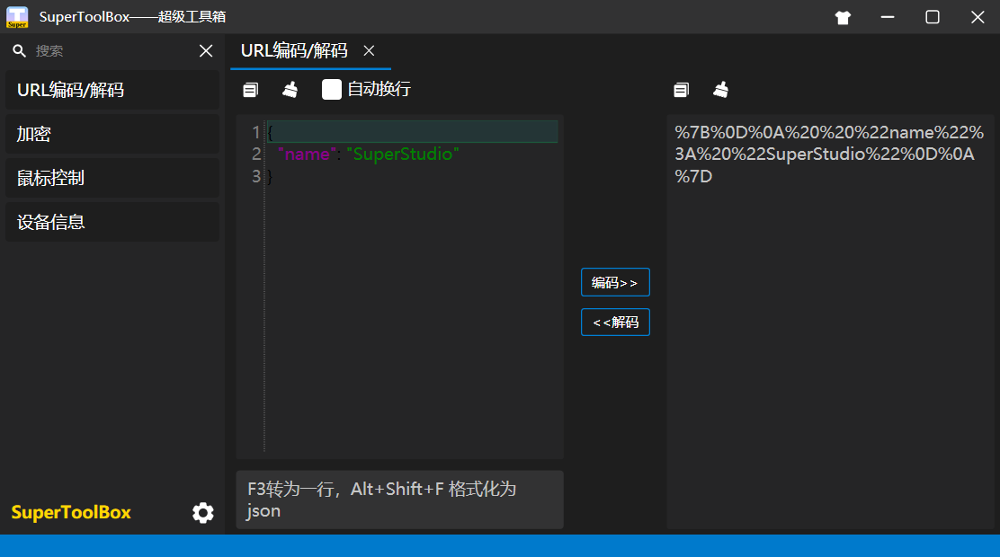
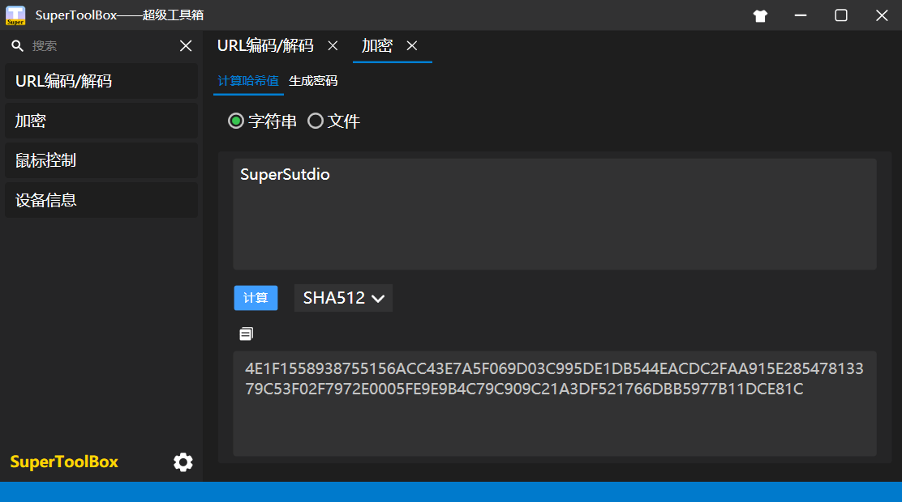
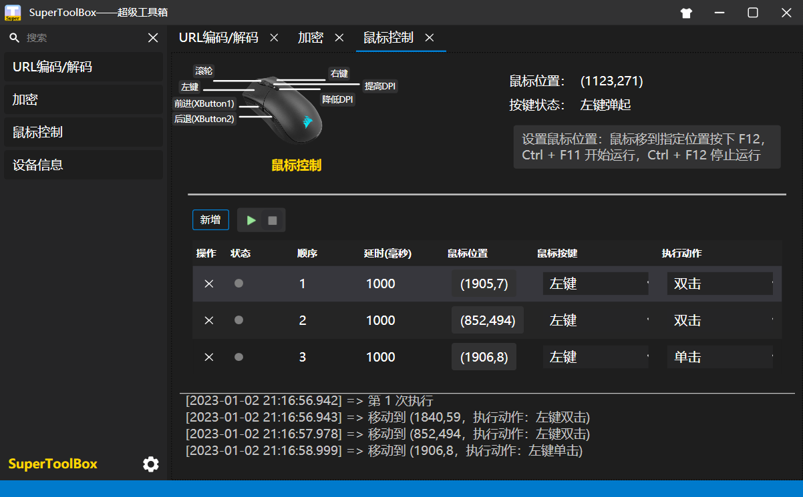
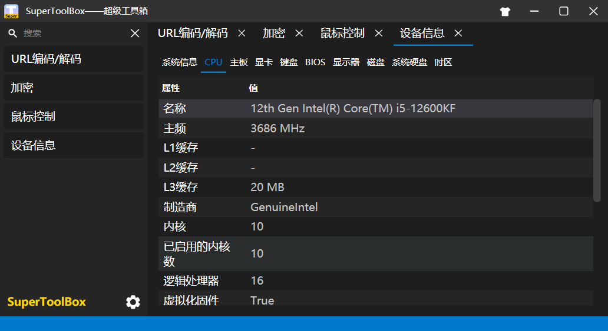

[中文](README.md) [English](README_EN.md) 

<h1 align="center">SuperToolBox</h1>

SuperToolBox 是一款**Window 工具箱**

下载地址：[点此下载](https://github.com/SuperStudio/SuperToolBox/releases)

# 关于

SuperToolBox 是一款**Window 工具箱**，支持以下功能：

- URL 编码/解码
- 加解密
- 鼠标控制
- 显示设备信息

具有的特殊功能：

- 更换皮肤
- 插件管理

一、URL 编码/解码

二、加解密

三、鼠标控制

四、显示设备信息

# 文档

用户文档：[Wiki](https://github.com/SuperStudio/SuperToolBox/wiki)

开发者文档：

# 分支说明

| 分支名           | 说明                                                   |
| ---------------- | ------------------------------------------------------ |
| master           | 主分支，其它用户拉取的主要代码，同时也是 PR 的目标分支 |
| dev-chao         | 私人的开发分支，避免影响到他人拉取                     |
| release_20220930 | 发布分支，用于各个项目引用，保证稳定的依赖关系         |

